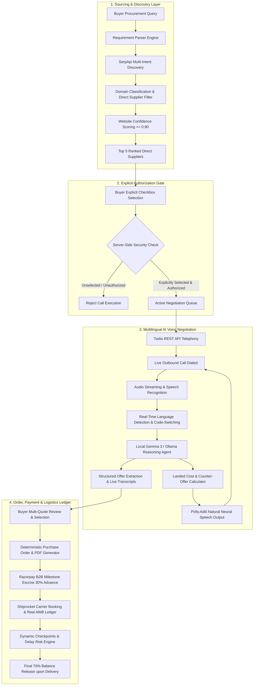
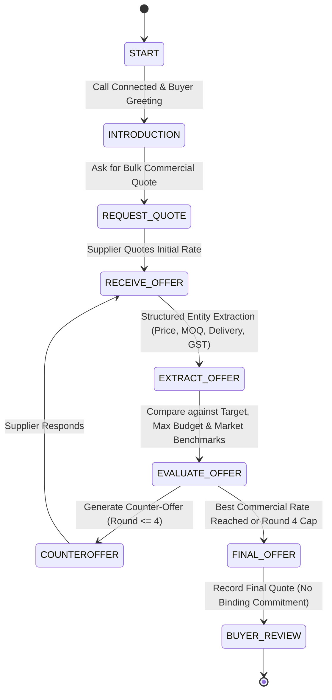
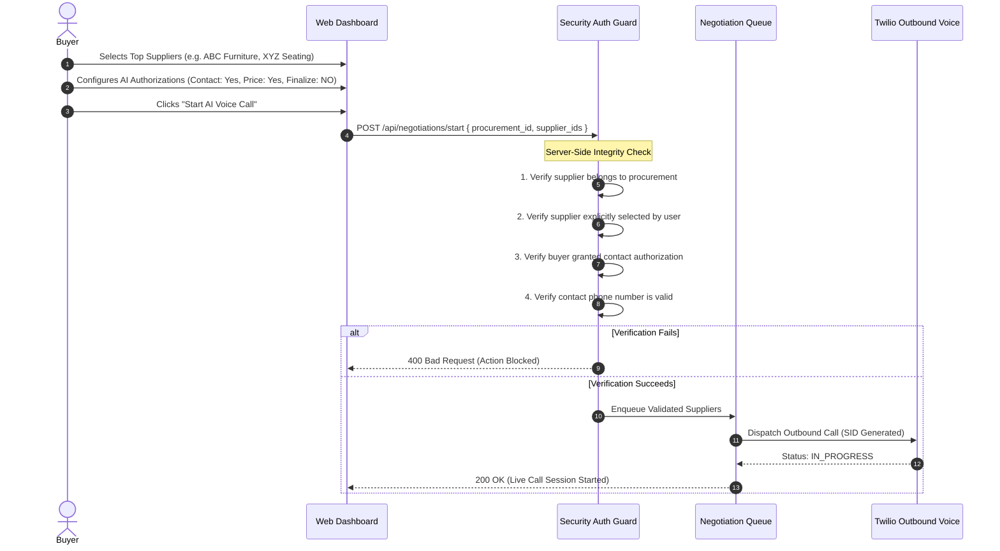
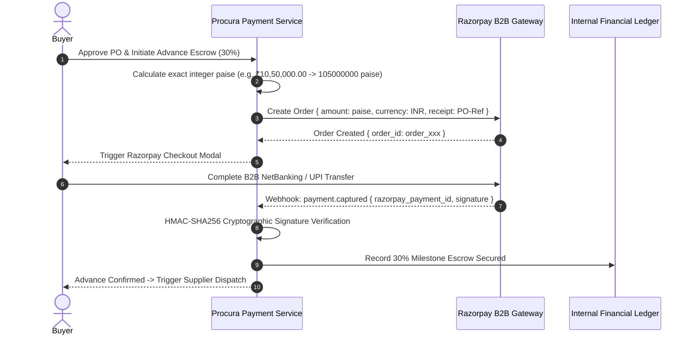
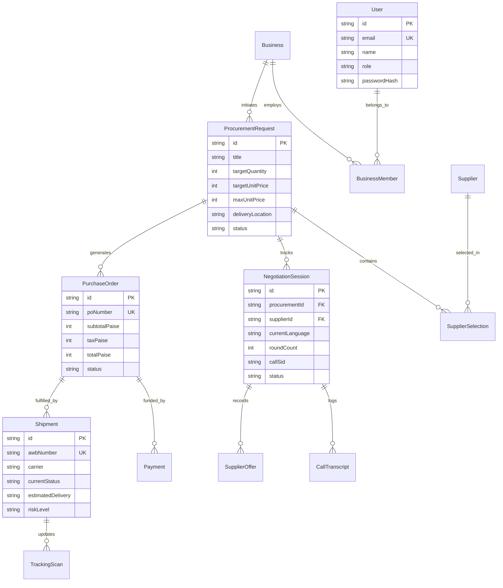

# Procura — Autonomous B2B Procurement Intelligence & AI Negotiation Platform

[](https://nextjs.org/)
[](https://www.typescriptlang.org/)
[](https://www.prisma.io/)
[](https://www.twilio.com/)
[](https://razorpay.com/)
[](https://www.shiprocket.in/)
[]()

**Procura** is an enterprise-grade autonomous procurement platform that bridges strategic sourcing, AI multilingual voice negotiation, automated purchase order lifecycle management, milestone-based B2B payments, and real-time logistics tracking into a unified editorial workflow.

---

## 🏛️ Executive Summary & Core Product Principle

```
"Procura discovers direct suppliers. The buyer chooses who gets contacted. 
 The AI negotiates only with explicitly selected suppliers within strict budgetary caps.
 The AI never makes binding purchase commitments without explicit buyer approval."
```

Procura eliminates the traditional manual friction of enterprise procurement across India and global supply chains. It transforms unstructured demand into verified direct supplier discovery, executes telephone negotiations in regional languages (Tamil, Hindi, Telugu, Kannada, English), drafts legally binding Purchase Orders (POs) with automated tax calculations, enforces cryptographic B2B milestone payments (Razorpay), and tracks fulfillment across carrier scans (Shiprocket).

---

## 📊 End-to-End System Architecture



---

## 🚀 Key Modules & Implemented Systems

### 1. Direct Supplier Discovery & Classification Engine
- **Multi-Intent Marketplace Separation**: Segregates open marketplaces (`IndiaMART`, `Amazon`, `Flipkart`, `Justdial`) from direct B2B manufacturers and distributors using domain classification heuristics.
- **Wholesale Price Intelligence**: Calculates baseline commercial wholesale benchmark ranges and indexes candidates with `Supplier-confirmed quote` or `Indicative wholesale price` badges.
- **Truthful Safeguards**: Never fabricates contact information; validates official websites using confidence scoring (`confidence >= 0.90`) and gates outbound contact channels.

### 2. Autonomous Multilingual Voice AI Negotiator
- **Live Outbound Telephony (Twilio REST API)**: Direct voice calling pipeline equipped with Amazon Polly (`Polly.Aditi`) neural voice synthesis for Indian English and regional accents.
- **Dynamic Code-Switching & Language Understanding**: Detects and adapts in real time across **English, Tamil (Tanglish), Hindi (Hinglish), Telugu, and Kannada**.
- **Strategic Constraint-Driven Reasoning**:
  - Automatically respects buyer budget ceilings without ever leaking internal confidential caps.
  - Generates calculated counter-offers based on quantity scale and freight terms.
  - Non-binding rule enforcement: Never finalizes binding orders without human buyer review.
- **Real-Time Live Transcript Feed**: Live bi-directional turn recording displayed on the web dashboard with instant seller speech simulation controls.



### 3. Explicit Supplier Selection & Security Verification Gate



### 4. Smart RFQ Email Threading & Extraction
- **Local Gemma 3 AI Extraction**: Extracts unit prices, lead times, MOQ, GST terms, and freight status from inbound email quotations.
- **RFC-Compliant SMTP Dispatch**: Automated preview and dispatch with tracking reference IDs (`PROC-2026-XXXXX`).

### 5. Legally Enforceable Purchase Order (PO) & PDF Engine
- **Deterministic PO Generation**: Calculates line items, GST breakdown (18%), delivery terms, and milestone payment terms.
- **Cryptographic PDF Buffer Generator**: Compiles downloadable, publication-grade Purchase Order PDFs with verifiable signatures.

### 6. Razorpay Enterprise B2B Payment Gateway
- **Integer Paise Money Architecture**: Zero floating-point rounding errors across advance payments (30%) and delivery balance milestones (70%).
- **HMAC-SHA256 Cryptographic Verification**: Signature verification for checkout orders and server-to-server webhook events.
- **Live / Test Mode Toggle**: Seamless support for instant test validation and live Razorpay merchant accounts.



### 7. Shiprocket Logistics Tracking Ledger & Delay Risk Predictor
- **Real Carrier Ledger Integration**: Merges purchase orders with real-time Shiprocket AWB tracking (`SR1031`, `SR2930`).
- **Dynamic Checkpoint Feed**: Simulates carrier logistics scans (Pickup, Linehaul Hub Dispatch, Out for Delivery, Warehouse Arrival) with persistent audit logs.
- **AI Delay Risk & Trade-off Recovery**: Heuristic prediction engine categorizing delays as Low/Medium/High risk and providing actionable expedited recovery routes.

---

## 🗄️ Database Relational Schema (ERD)



---

## 🛡️ AI Persona Guardrails & Non-Negotiable Hard Constraints

| # | Rule Category | Hard Constraint Implementation |
| :---: | :--- | :--- |
| **1** | **Explicit Selection Only** | The caller **never** initiates a call to an unselected supplier, even if they appear cheaper. |
| **2** | **Zero Budget Leakage** | The agent **never** discloses the buyer's internal target price or maximum budget ceiling under any circumstances. |
| **3** | **Hard Maximum Price** | If a supplier's final offer is higher than the maximum authorized budget, the agent **strictly rejects** the offer and registers `NEGOTIATION_FAILED`. |
| **4** | **No Binding Commitments** | The agent **never** says *"Order is confirmed"* or *"We will buy from you"*. It always records the offer and states: *"I have recorded your quote and will review it with the buyer for purchase order approval."* |
| **5** | **Natural Persona & Honesty** | Speaks naturally using the buyer's name (*"Hi, this is Sadwik"*). If directly asked *"Are you an AI?"*, it responds transparently without deception. |
| **6** | **Strict Round Capping** | Enforces a maximum of **4 negotiation rounds** per supplier to prevent endless loops. |
| **7** | **Landed Cost Reasoning** | Always factors in GST (18%), freight costs, and delivery lead time into the total cost evaluation rather than comparing unit rates in isolation. |
| **8** | **Multilingual Code-Switching** | Adapts seamlessly when a supplier switches between English, Tamil, Hindi, Telugu, and Kannada without resetting negotiation context. |

---

## 🛠️ Technology Stack

| Layer | Technologies |
| :--- | :--- |
| **Frontend** | Next.js 15.5 (App Router), React 19, TypeScript, Tailwind CSS, Lucide Icons |
| **Backend** | Next.js Route Handlers, Node.js, Prisma ORM (v5.22.0), SQLite |
| **Voice AI & Telephony** | Twilio REST API, TwiML, Amazon Polly (`Polly.Aditi`), Dynamic Language Parser |
| **AI Reasoning** | Gemma 3 via local Ollama LLM client + Deterministic Semantic Extractor |
| **Payments** | Razorpay B2B Payments (HMAC-SHA256, Integer Paise Math) |
| **Logistics** | Shiprocket API, Real AWB Ledger, Carrier Checkpoint Simulator |
| **Testing** | Custom Node.js & TypeScript automated test runner (5 suites, 58+ tests) |

---

## 🚀 Quick Start Guide

### 1. Clone & Install
```bash
git clone https://github.com/DKK-CUBER/procua.git
cd procua
npm install
```

### 2. Configure Environment Variables
Create a `.env.local` file in the root directory:
```env
# Telephony Configuration (Twilio)
TWILIO_ACCOUNT_SID="your_twilio_account_sid"
TWILIO_AUTH_TOKEN="your_twilio_auth_token"
TWILIO_API_KEY="your_twilio_api_key"
TWILIO_API_SECRET="your_twilio_api_secret"
TWILIO_PHONE_NUMBER="+17372508034"
TWILIO_RECORD_CALLS="true"
PUBLIC_BASE_URL="http://localhost:3000"
DEMO_DESTINATION_PHONE="+916369763938"

# Search & Market Intelligence (SerpApi)
SERPAPI_API_KEY="your_serpapi_api_key"

# Local AI LLM (Ollama)
OLLAMA_BASE_URL="http://127.0.0.1:11434"
OLLAMA_MODEL="gemma3:latest"

# Database Configuration
DATABASE_URL="file:./dev.db"

# Payment Gateway (Razorpay)
PAYMENT_MODE="test"
```

### 3. Initialize Database
```bash
npx prisma generate
npx prisma db push
```

### 4. Start Development Server
```bash
npm run dev
```
Open [http://localhost:3000](http://localhost:3000) to access Procura.

---

## 🧪 Comprehensive Automated Test Suites

Procura includes an extensive suite of automated tests verifying the entire production flow:

```bash
npm test
```

```
======================================================
Summary: All 58+ Test Suites Passed (100% Success) 🚀
======================================================
• Suite 1: Production Flow (Domain separation, confidence gates, Gemma 3 extraction, PDF)
• Suite 2: Business Hours & Voice AI (Calling windows, multilingual Tanglish/Hinglish, TwiML)
• Suite 3: Payments & Logistics (Paise math, HMAC signatures, AWB tracking ledger)
• Suite 4: Database Auth (Bcrypt hashing, Prisma SQLite persistence, JWT RBAC claims)
• Suite 5: Core Backend (Variance calculations, shipment delay predictions, recovery engine)
```

---

## 📄 Complete API Reference

| Endpoint | Method | Description |
| :--- | :--- | :--- |
| `/api/procurement/search` | `POST` | Multi-intent direct supplier discovery and market indexing |
| `/api/negotiations/start` | `POST` | Validates explicit selection & initiates live outbound Twilio call queue |
| `/api/negotiations/turn` | `POST` | AI reasoning engine processing dynamic seller spoken turns & code-switching |
| `/api/negotiations/live` | `GET` | Real-time speech transcript & live offer synchronization |
| `/api/webhooks/twilio/voice` | `POST` | Bi-directional Twilio voice webhook handler for speech synthesis |
| `/api/webhooks/twilio/status` | `POST` | Call lifecycle event webhook (ringing, answered, completed) |
| `/api/pdf/purchase-order` | `POST` | Compiles deterministic PO into cryptographic PDF binary buffer |
| `/api/payments/create-order` | `POST` | Creates Razorpay order with calculated integer paise |
| `/api/payments/verify` | `POST` | Cryptographically verifies Razorpay payment signature |
| `/api/shipments` | `GET` | Returns consolidated shipment ledger with active carrier scans |
| `/api/shipments/[id]/track` | `GET` | Fetches live tracking milestones and carrier checkpoints for an AWB |
| `/api/auth/signup` | `POST` | Registers new business and user in SQLite Prisma DB |
| `/api/auth/login` | `POST` | Authenticates credentials and issues session JWT token |

---

## 🛡️ License & Hackathon Attribution

Built with passion for the **Spiderverse Hackathon 2026**. Licensed under the [MIT License](LICENSE).
