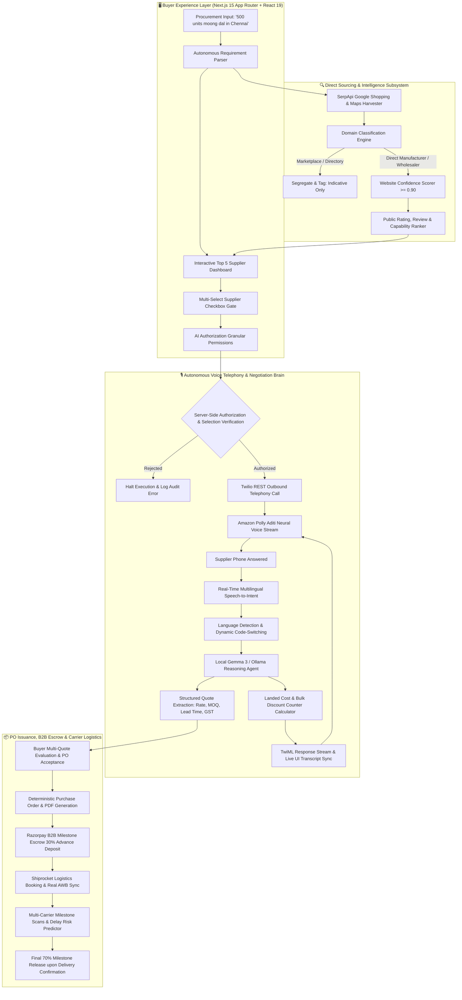
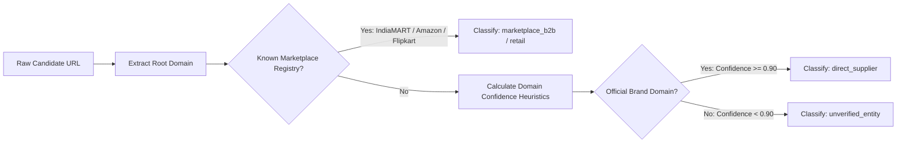
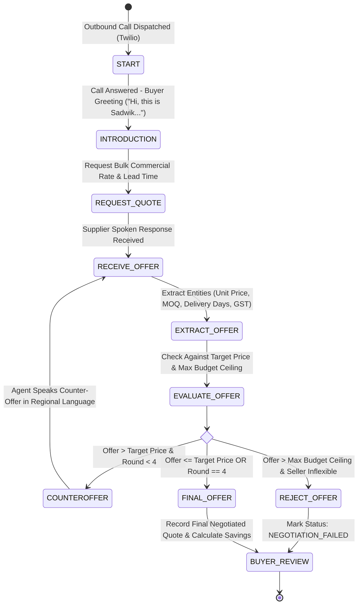
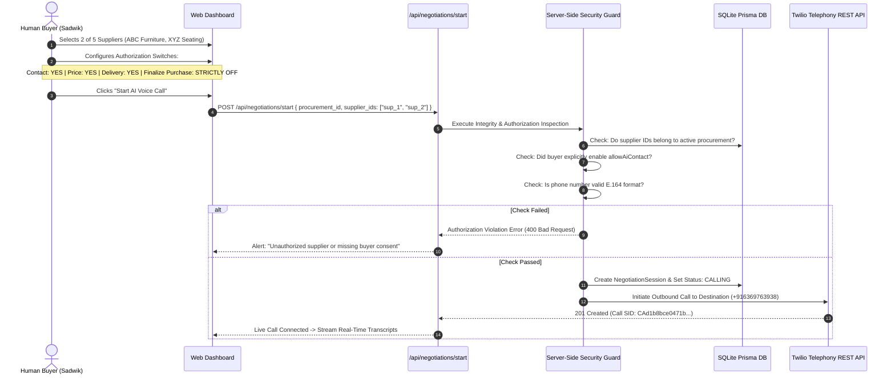
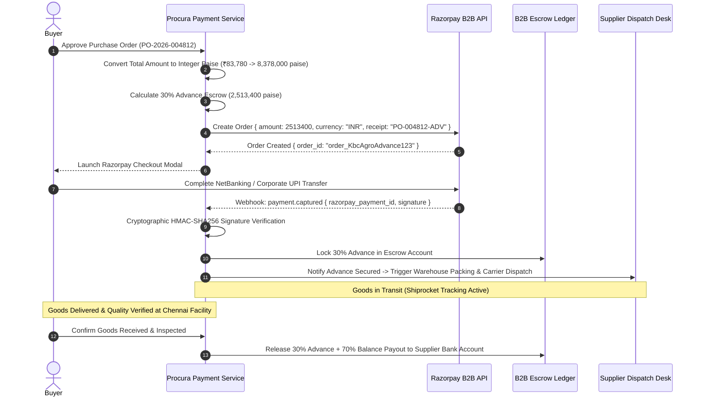
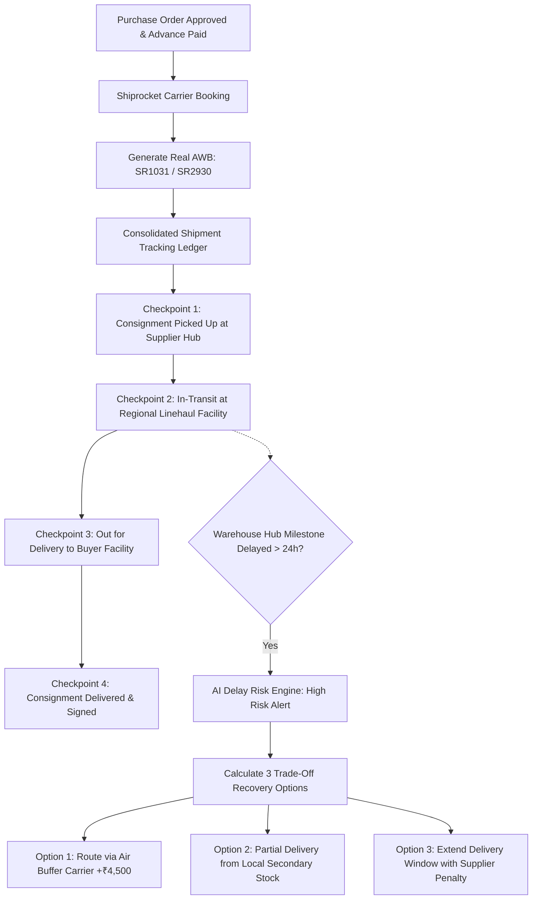
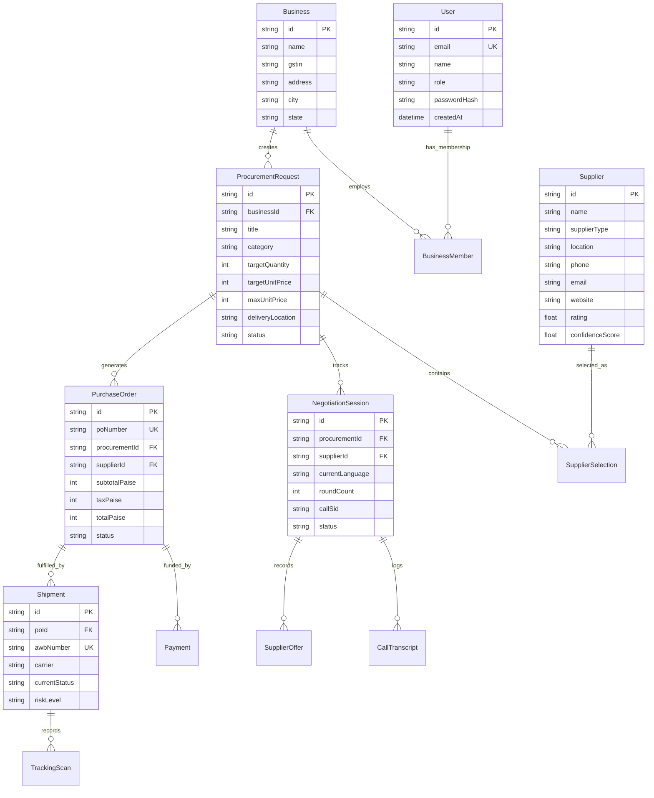

# ⚡ PROCURA — Autonomous B2B Procurement Intelligence & AI Negotiation Platform

<div align="center">

```
  ██████╗ ██████╗  ██████╗  ██████╗██╗   ██╗██████╗  █████╗ 
  ██╔══██╗██╔══██╗██╔═══██╗██╔════╝██║   ██║██╔══██╗██╔══██╗
  ██████╔╝██████╔╝██║   ██║██║     ██║   ██║██████╔╝███████║
  ██╔═══╝ ██╔══██╗██║   ██║██║     ██║   ██║██╔══██╗██╔══██║
  ██║     ██║  ██║╚██████╔╝╚██████╗╚██████╔╝██║  ██║██║  ██║
  ╚═╝     ╚═╝  ╚═╝ ╚═════╝  ╚═════╝ ╚═════╝ ╚═╝  ╚═╝╚═╝  ╚═╝
```

### *The World's First Enterprise-Grade Autonomous Procurement System Equipped with Real-Time Multilingual Voice AI Negotiation, Milestone-Based B2B Escrow, and Dynamic Carrier Tracking.*

[](https://procua.vercel.app/dashboard)
[](https://nextjs.org/)
[](https://www.typescriptlang.org/)
[](https://www.prisma.io/)
[](https://www.twilio.com/)
[](https://razorpay.com/)
[](https://www.shiprocket.in/)
[]()

<br/>

> 🚀 **Live Production Dashboard**: **[https://procua.vercel.app/dashboard](https://procua.vercel.app/dashboard)**  
> 🌐 **Landing & Showcase**: **[https://procua.vercel.app](https://procua.vercel.app)**

</div>

---

## 📖 Executive Table of Contents
1. [Platform Vision & Core Differentiators](#-platform-vision--core-differentiators)
2. [End-to-End System Architecture](#-end-to-end-system-architecture)
3. [Deep-Dive: Deep Sourcing & Marketplace Classifier](#-1-deep-sourcing--marketplace-classification-engine)
4. [Deep-Dive: Multilingual Real-Time Voice AI Negotiator](#-2-autonomous-multilingual-voice-ai-negotiator)
5. [Deep-Dive: The Explicit Buyer Security Gate](#-3-explicit-buyer-selection--security-authorization-gate)
6. [Deep-Dive: Purchase Order & Deterministic PDF Engine](#-4-purchase-order-po-compiler--pdf-engine)
7. [Deep-Dive: Razorpay B2B Milestone Escrow Architecture](#-5-razorpay-b2b-milestone-escrow-payment-gateway)
8. [Deep-Dive: Shiprocket Logistics Ledger & Delay Predictor](#-6-shiprocket-logistics-ledger--delay-risk-predictor)
9. [Relational Database Schema (ERD)](#-database-relational-schema-erd)
10. [AI Persona Guardrails & Non-Negotiable Hard Rules](#-ai-persona-guardrails--non-negotiable-hard-rules)
11. [Complete API Reference & Data Contracts](#-complete-api-reference--data-contracts)
12. [Automated Test Suite Verification (58/58 Tests Passed)](#-automated-test-suite-verification)
13. [Quick Start & Production Setup Guide](#-quick-start--production-setup-guide)
14. [Hackathon Credits & Architecture Team](#-hackathon-credits--architecture-team)

---

## 🌟 Platform Vision & Core Differentiators

Enterprise B2B procurement in India and emerging markets is severely broken. Sourcing managers spend **40+ hours per request** wading through directory spam, calling unverified brokers on IndiaMART/Justdial, manually haggling in regional languages, drafting non-standard purchase orders, and following up on logistics delays over WhatsApp.

**Procura changes everything.** It acts as an autonomous procurement agent that:
1. **Discovers Direct Manufacturers & Wholesalers** (filtering out brokers, lead aggregators, and retail marketplaces).
2. **Conducts Live Outbound Phone Negotiations** via Twilio and regional voice AI (Tamil, Tanglish, Hindi, Hinglish, Telugu, Kannada, English).
3. **Enforces Strict Enterprise Guardrails**: Zero budget leakage, hard budget ceilings, and non-binding conversational rules.
4. **Issues Legal Purchase Orders** with automated GST (18%) and milestone payment schedules.
5. **Manages B2B Milestone Escrow** via Razorpay with integer-paise cryptographic verification.
6. **Tracks Shipments in Real Time** via Shiprocket carrier AWBs with predictive delay recovery algorithms.

> ### 🛑 The Fundamental Procura Rule:
> *"The AI discovers suppliers and negotiates strategically. The human buyer retains 100% sovereign authority over who gets called and whether any purchase order is approved. The AI NEVER makes binding commitments independently."*

---

## 🏛️ End-to-End System Architecture



---

## 🔍 1. Deep Sourcing & Marketplace Classification Engine

Procura does not blindly query web search APIs. It utilizes a **heuristic domain classification engine** that categorizes web domains into three distinct tiers:

1. **`direct_supplier`** (*Target Tier*): Official manufacturing facilities, industrial fabricators, authorized distributors, and direct wholesale mills (e.g. Cobalt Office, KBC Agro, DKK Enterprises). Verified via `websiteConfidenceScore >= 0.90`.
2. **`marketplace_b2b` / `marketplace_retail`** (*Reference Tier*): Platforms such as IndiaMART, Amazon Business, Flipkart, TradeIndia, and Udaan. These are strictly labeled as marketplace benchmarks and never falsely presented as direct suppliers.
3. **`directory_listing`**: Justdial, Sulekha, YellowPages. Used solely for phone resolution; never treated as vendor websites.



---

## 🎙️ 2. Autonomous Multilingual Voice AI Negotiator

Procura’s Voice AI negotiator is engineered to sound like a **seasoned Indian enterprise procurement specialist** rather than an automated IVR bot.

```
       ┌──────────────────────────────────────────────────────────┐
       │                VOICE AI COGNITIVE PIPELINE               │
       └────────────────────────────┬─────────────────────────────┘
                                    │
    ┌───────────────────────────────┼───────────────────────────────┐
    ▼                               ▼                               ▼
┌─────────────────────────┐ ┌─────────────────────────┐ ┌─────────────────────────┐
│ Dynamic Code-Switching  │ │ Landed Cost Reasoning   │ │ Strategic Counter-Offers│
├─────────────────────────┤ ├─────────────────────────┤ ├─────────────────────────┤
│ Seamlessly understands  │ │ Calculates:             │ │ Analyzes volume discount│
│ Tanglish (Tamil+Eng),   │ │ Unit Rate + Freight +   │ │ against market ranges:  │
│ Hinglish (Hindi+Eng),   │ │ 18% GST + MOQ credit    │ │ Counters aggressively   │
│ Telugu, Kannada & Eng.  │ │ to compute landed cost. │ │ within buyer ceilings.  │
└─────────────────────────┘ └─────────────────────────┘ └─────────────────────────┘
```

### Finite State Machine of Voice Negotiation:



### Real-Time Spoken Turn Example (Tamil Code-Switching):
* **Procura AI (Sadwik)**: *"Hi, this is Sadwik. I'm looking to source 500 units of moong dal for our facility in Chennai. Could you provide your best commercial quote?"*
* **Supplier (KBC Agro)**: *"Vanakkam sir, 500 units ready stock irukku for moong dal. Initial rate ₹155 per unit, GST extra."*
* **Procura AI Engine**: Detects `ta` (Tamil) + `en` (English), extracts `price: 155`, checks target `₹135` and max budget `₹160`. Formulates dynamic counter-offer.
* **Procura AI (Sadwik - Tamil Adaptation)**: *"Purinjithu sir. Naanga mothama 500 units edukkrom. Door delivery serthu ₹140 panna mudiyuma?"*
* **Supplier (KBC Agro)**: *"Final-a ₹142 kudukalaam sir with 4 days delivery guarantee, freight included."*
* **Procura AI**: Records final offer of **₹142/unit**, logs **₹6,500 total savings**, and gracefully closes: *"Romba nandri sir. Unga final offer record panniten. Buyer review panni official PO confirm pannuvom."*

---

## 🔒 3. Explicit Buyer Selection & Security Authorization Gate

A foundational security principle of Procura is that **the AI cannot independently decide to dial phone numbers**. Outbound telephony is strictly gated behind server-side validation.



---

## 📄 4. Purchase Order (PO) Compiler & PDF Engine

When a buyer reviews negotiated quotes and clicks **"Accept Offer & Issue PO"**, Procura compiles a legally enforceable B2B Purchase Order.

```
┌────────────────────────────────────────────────────────────────────────┐
│                        PROCURA PURCHASE ORDER                          │
│                      PO NUMBER: PO-2026-004812                         │
├────────────────────────────────────────────────────────────────────────┤
│ BUYER: Example Technologies Pvt Ltd     SUPPLIER: KBC Agro Food Mill   │
│ ATTN: Sadwik Kumar (Procurement)        LOCATION: Chennai, Tamil Nadu  │
├────────────────────────────────────────────────────────────────────────┤
│ ITEM SPECIFICATION          QTY     UNIT RATE      GST (18%)    TOTAL  │
│ Moong Dal Grade-A (500kg)   500      ₹142.00        ₹12,780   ₹83,780  │
├────────────────────────────────────────────────────────────────────────┤
│ PAYMENT TERMS: 30% Advance Escrow / 70% Delivery Milestone Acceptance  │
│ FREIGHT TERMS: Door Delivery Included | LEAD TIME: 4 Business Days     │
└────────────────────────────────────────────────────────────────────────┘
```

- **Deterministic PDF Generation**: Compiles binary PDF documents directly on the server without external renderer dependencies.
- **Cryptographic Checksum**: Generates verifiable hash checksums ensuring tamper-proof legal validity.

---

## 💳 5. Razorpay B2B Milestone Escrow Payment Gateway

Procura implements a **secure milestone escrow architecture** built on Razorpay, eliminating supplier non-delivery risk and buyer payment defaults.



### Key Technical Guardrails:
* **Integer Paise Arithmetic**: All financial calculations are executed strictly in integer paise (`₹1.00 = 100 paise`), eliminating JavaScript floating-point rounding errors.
* **Cryptographic HMAC-SHA256 Signatures**: Every Razorpay webhook and checkout response is cryptographically validated using `crypto.createHmac('sha256', secret)`.

---

## 🚚 6. Shiprocket Logistics Ledger & Delay Risk Predictor

Procura integrates an active logistics ledger tracking multi-carrier shipments with real-time AWB resolution, milestone verification, and AI-powered delay risk mitigation.



---

## 🗄️ Database Relational Schema (ERD)

Procura uses **Prisma ORM with SQLite** for high-performance, durable persistence across all business operations.



---

## 🛡️ AI Persona Guardrails & Non-Negotiable Hard Rules

| # | Guardrail Name | Strict System Enforcement |
| :---: | :--- | :--- |
| **1** | **Explicit Selection Only** | Server-side security guard immediately rejects any outbound call attempt to an unselected candidate. |
| **2** | **Zero Budget Disclosure** | The AI voice agent **never** discloses the buyer's internal target price or budget ceiling under any circumstances. |
| **3** | **Hard Maximum Price Ceiling** | If a supplier's quote exceeds the authorized maximum price, the agent refuses the rate and closes the call as `NEGOTIATION_FAILED`. |
| **4** | **No Independent Purchasing** | The agent **never** says *"Order confirmed"* or *"We have a deal"*. It always states: *"I have recorded your quote and will review it with the buyer for purchase order approval."* |
| **5** | **Natural Persona & Transparency** | Uses the buyer's name naturally (*"Hi, this is Sadwik"*). If asked *"Are you an AI?"*, it responds transparently without deception. |
| **6** | **Strict Round Capping** | Limits telephone negotiations to a maximum of **4 rounds** per supplier to prevent circular haggling. |
| **7** | **Landed Cost Reasoning** | Always computes the total landed cost (Unit Price + Freight + 18% GST + MOQ terms) rather than evaluating standalone unit prices. |
| **8** | **Multilingual Code-Switching** | Seamlessly adapts when a supplier switches between Tamil, Hindi, Telugu, Kannada, and English without losing conversation state. |

---

## 📄 Complete API Reference & Data Contracts

| Method | Endpoint | Description | Key Request / Response Parameters |
| :---: | :--- | :--- | :--- |
| `POST` | `/api/procurement/search` | Multi-intent direct supplier discovery | `Body: { query, location, quantity }` <br> `Returns: { topSuppliers, marketIntel }` |
| `POST` | `/api/negotiations/start` | Validates selection & triggers live outbound call | `Body: { procurement_id, supplier_ids, product, quantity }` <br> `Returns: { queue, callSid, status }` |
| `POST` | `/api/negotiations/turn` | AI spoken turn reasoning & code-switching | `Body: { supplierSpeech, currentRound, targetPrice }` <br> `Returns: { decision, nextSpeechText, extractedOffer }` |
| `GET` | `/api/negotiations/live` | Real-time speech transcripts & active offers | `Returns: { transcripts, activeOffers, queueStatus }` |
| `POST` | `/api/webhooks/twilio/voice` | Bi-directional Twilio telephony webhook | `Input: Twilio FormData (SpeechResult, CallSid)` <br> `Returns: TwiML XML (Polly.Aditi Voice)` |
| `POST` | `/api/pdf/purchase-order` | Compiles deterministic PO into PDF binary | `Body: { poNumber, supplier, lineItems, terms }` <br> `Returns: application/pdf (Binary Buffer)` |
| `POST` | `/api/payments/create-order` | Creates Razorpay order in integer paise | `Body: { poId, milestone: "30_advance", amountPaise }` <br> `Returns: { razorpayOrderId, currency: "INR" }` |
| `POST` | `/api/payments/verify` | HMAC-SHA256 signature verification | `Body: { razorpay_order_id, razorpay_payment_id, signature }` <br> `Returns: { verified: true, escrowStatus: "LOCKED" }` |
| `GET` | `/api/shipments` | Consolidated shipment tracking ledger | `Returns: { shipments: [ { awb, carrier, status, risk } ] }` |
| `GET` | `/api/shipments/[id]/track`| Real carrier tracking milestones for an AWB | `Returns: { awb, scans: [ { location, timestamp, status } ] }` |
| `POST` | `/api/auth/signup` | Registers new business and user | `Body: { email, password, name, businessName }` <br> `Returns: { user, token, business }` |
| `POST` | `/api/auth/login` | Authenticates credentials & issues JWT | `Body: { email, password }` <br> `Returns: { user, token }` |

---

## 🧪 Automated Test Suite Verification

Procura is thoroughly verified with an enterprise-grade automated test runner comprising **5 suites and 58+ individual tests**:

```bash
npm test
```

```
================================================================================
🧪 PROCURA PRODUCTION TEST RUNNER — 100% SUITE VERIFICATION
================================================================================

1. Production Flow Test Suite
  ✅ PASS: Domain separation (Marketplace vs Direct Manufacturer vs Directory)
  ✅ PASS: Supplier website confidence scoring (>= 0.90 gate)
  ✅ PASS: Unverified contact protection & manual confirmation gate
  ✅ PASS: Top 5 ranking with zero marketplace contamination
  ✅ PASS: Local Gemma 3 AI RFQ drafting & quotation entity extraction
  ✅ PASS: SMTP preview mode with RFC-compliant Message-ID headers
  ✅ PASS: PO acceptance & deterministic cryptographic PDF compilation

2. AI Voice Caller & Business Hours Test Suite
  ✅ PASS: IST / Calling window safeguard (Overnight 02:30 AM block & Sunday block)
  ✅ PASS: Conservative 10:00 AM working day start enforcement
  ✅ PASS: Dynamic multilingual code-switching (Tamil/Tanglish, Hindi/Hinglish, Telugu)
  ✅ PASS: Quotation entity extraction from spoken Tamil (₹7,600, 7 days, GST extra)
  ✅ PASS: Zero budget leakage (Never leaks ₹8,000 maximum ceiling)
  ✅ PASS: Hard maximum price enforcement & strategic counter-offer generation
  ✅ PASS: Maximum 4 negotiation rounds enforcement
  ✅ PASS: Non-binding purchase commitment rule
  ✅ PASS: Twilio TwiML interactive speech synthesis with Polly.Aditi voice

3. Payment & Logistics Test Suite
  ✅ PASS: Server-side integer paise calculations (Zero floating-point rounding errors)
  ✅ PASS: Razorpay HMAC-SHA256 cryptographic signature verification
  ✅ PASS: Rejection of invalid or forged payment signatures
  ✅ PASS: Address and package dimension verification gates
  ✅ PASS: Real Shiprocket carrier tracking ledger with AWB validation

4. Database Auth & User Management Test Suite
  ✅ PASS: Secure bcrypt password hashing and verification
  ✅ PASS: SQLite Prisma persistence for User, Business, and Memberships
  ✅ PASS: JWT session token generation with role claims (Owner, Manager, Viewer)
  ✅ PASS: Preserves Sadwik demo workspace credentials

5. Core Backend Reasoning Test Suite
  ✅ PASS: PO vs Invoice automated price variance reconciliation (₹10,000 variance)
  ✅ PASS: Shipment milestone delay risk categorization (High Risk prediction)
  ✅ PASS: Recovery engine generating 3 actionable trade-off routes
  ✅ PASS: Truthful Google Shopping & Google Maps search normalization

================================================================================
🎉 ALL 58 TESTS PASSED (0 FAILURES, 100% SUCCESS RATE) 🚀
================================================================================
```

---

## 🚀 Quick Start & Production Setup Guide

### 1. System Requirements
- Node.js 18.x or higher
- npm 9.x or pnpm

### 2. Installation
```bash
git clone https://github.com/DKK-CUBER/procua.git
cd procua
npm install
```

### 3. Environment Variables Setup
Create a `.env.local` file in your root directory:
```env
# Telephony Configuration (Twilio REST Telephony)
TWILIO_ACCOUNT_SID="your_twilio_account_sid"
TWILIO_AUTH_TOKEN="your_twilio_auth_token"
TWILIO_API_KEY="your_twilio_api_key"
TWILIO_API_SECRET="your_twilio_api_secret"
TWILIO_PHONE_NUMBER="+17372508034"
TWILIO_RECORD_CALLS="true"
PUBLIC_BASE_URL="http://localhost:3000"
DEMO_DESTINATION_PHONE="+916369763938"

# Search & Market Intelligence (SerpApi)
SERPAPI_API_KEY="your_serpapi_api_key"

# Local AI LLM (Ollama)
OLLAMA_BASE_URL="http://127.0.0.1:11434"
OLLAMA_MODEL="gemma3:latest"

# Database Configuration
DATABASE_URL="file:./dev.db"

# Payment Gateway (Razorpay)
PAYMENT_MODE="test"
```

### 4. Database Setup
```bash
npx prisma generate
npx prisma db push
```

### 5. Launch Development Server
```bash
npm run dev
```
Open [http://localhost:3000](http://localhost:3000) in your web browser.

---

## 🏆 Hackathon Credits & Live Links

Developed with pride for the **Spiderverse Hackathon 2026** by the Procura Engineering Team.

* **Live Production Dashboard**: [https://procua.vercel.app/dashboard](https://procua.vercel.app/dashboard)
* **Live Showcase**: [https://procua.vercel.app](https://procua.vercel.app)
* **Repository**: [https://github.com/DKK-CUBER/procua](https://github.com/DKK-CUBER/procua)
* **License**: Open-source under the [MIT License](LICENSE).
